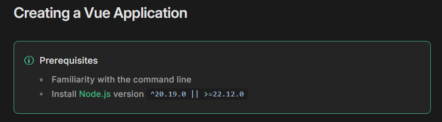
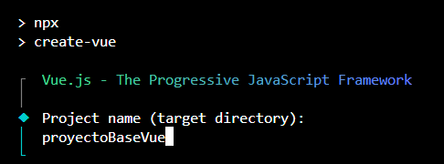
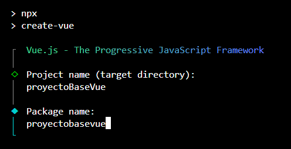
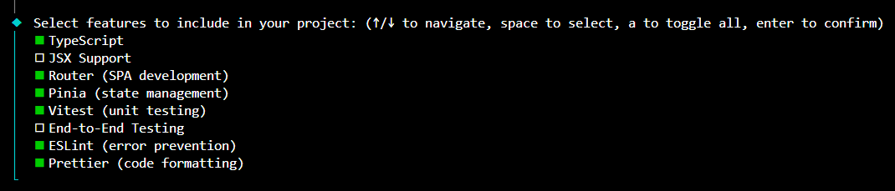
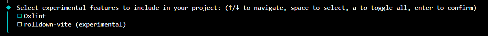
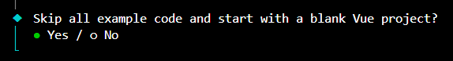
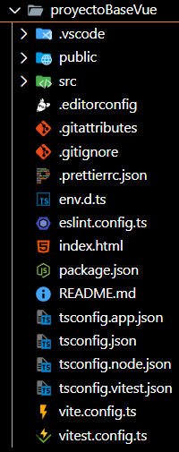
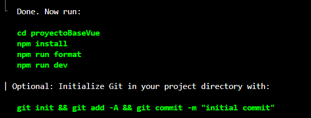
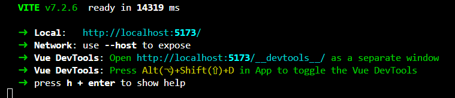
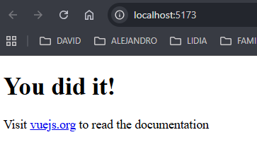

# Proyecto Vue JS en Visual Studio Code

## Confirmación de version de Node

Antes de crear un proyecto Vue, conviene comprobar que tu versión de Node.js es compatible con la versión actual de Vue.



Para consultar tu versión instalada, ejecuta:

```bash
node --version
```

Si tu versión es inferior a la recomendada, actualiza Node.js antes de continuar para evitar errores durante la creación o ejecución del proyecto.

## Creando un proyecto ejemplo con npm

Puedes iniciar un proyecto Vue con npm o con el CLI de Vue.

### Opción 1: npm (recomendada)

```bash
npm init vue@latest
```

### Opción 2: Vue CLI

```bash
vue create proyectoBaseVue
```

Durante el asistente interactivo:

1. Se solicita el nombre del proyecto. En este ejemplo: `proyectoBaseVue`.



2. Se solicita el `package name`. Puedes dejar el valor por defecto.



3. Se muestra el menú para elegir características. Marca las que vayas a usar.



4. Se pregunta por características experimentales. En este ejemplo, no se marca ninguna.



5. Se pregunta por plantilla base o de ejemplo. En este caso, se elige proyecto en blanco.



6. El asistente genera la estructura inicial del proyecto.



7. Al finalizar, se muestran los comandos para instalar dependencias y levantar la app.



8. Una vez ejecutado, el servidor de desarrollo indica URL y puerto para abrir la aplicación.



9. Abre la URL indicada para verificar que el proyecto funciona.


